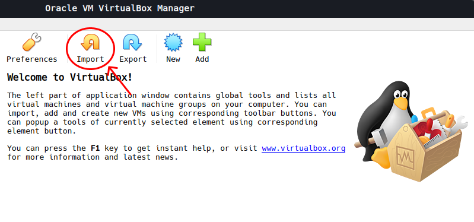
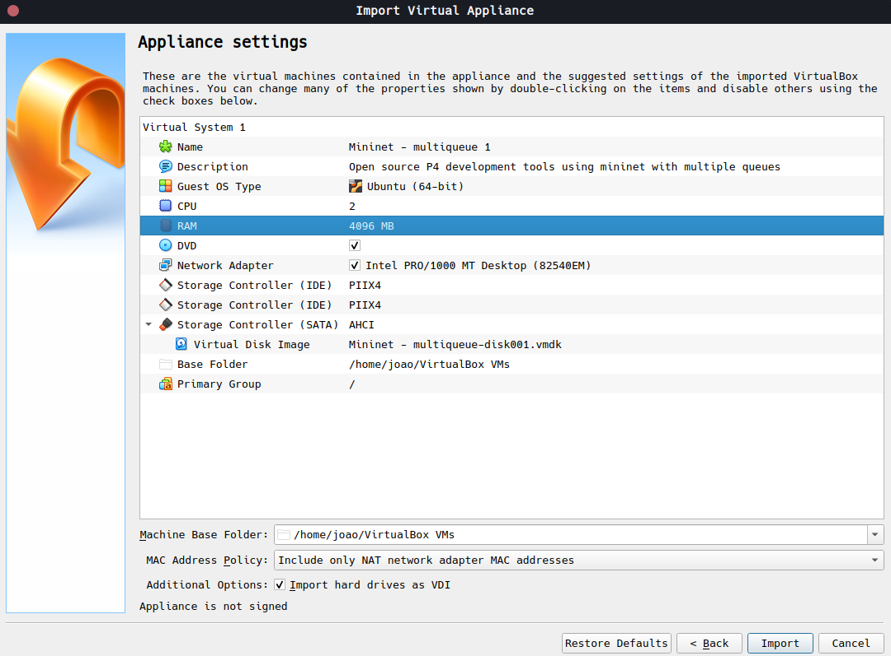

# MM-INT Monitor

This is a tool built for monitoring [M-PolKA](https://ieeexplore.ieee.org/document/9738811/authors#authors) networks metadata with multiqueue switches through INT (In-Band Telemetry) probes. 

## Installation
 - Firstly, you should install [VirtualBox](https://www.virtualbox.org/wiki/Downloads).
 - Download this [virtual machine](https://drive.google.com/file/d/13a50AjPgYaTHknkU71zguEEmLHHJq54i/view), as it comes with a configured environment with some crucial dependencies for the tool.
 - Then, import the file:
 
 - Allocate at least 4GB of RAM to the machine to prevent frequent freezing:
 
 - After importing, start the VM and choose *vagrant* user. The password is *vagrant* too.
 - **In the home directory**, clone this project:
```bash
git clone https://github.com/vortex2jm/MM-INT.git && cd MM-INT
```
*Obs: The tool will only work if the repository is cloned into the specified directory.*
 - Now you can do some setting up steps:
```bash
sudo chmod +x ./util/scripts/setup.sh
```
```bash
./util/scripts/setup.sh
```
This script will install some python dependencies and the docker engine.
 
 - The final step is to install the database:
```bash
sudo chmod +x ./util/scripts/createdb.sh
```
```bash
./util/scripts/createdb.sh
```

#
 
If you followed all the steps so far, the environment should be fully configured. Now, you can check the usage [here]()
