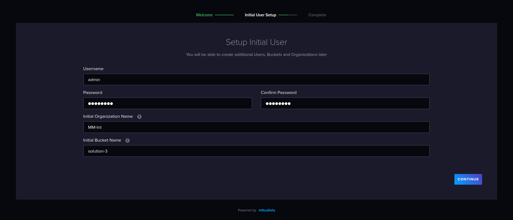
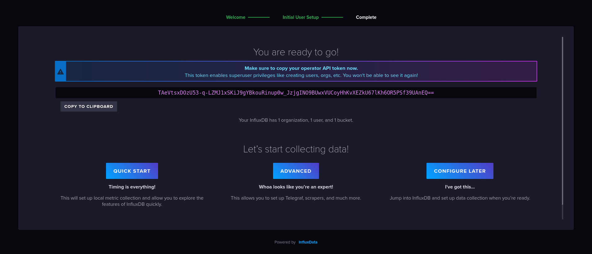
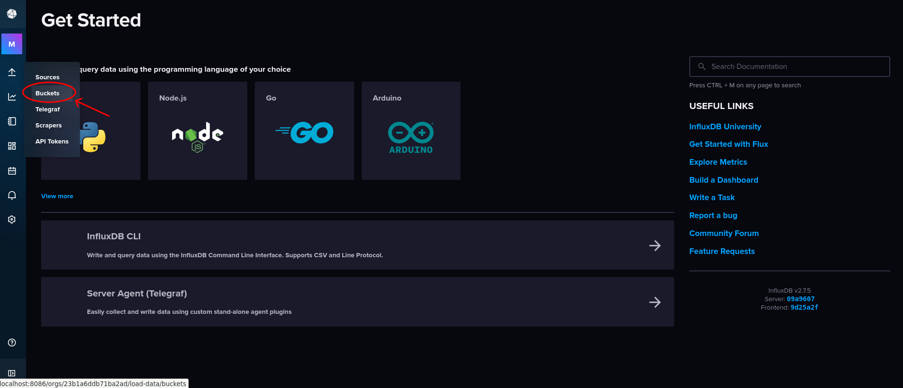
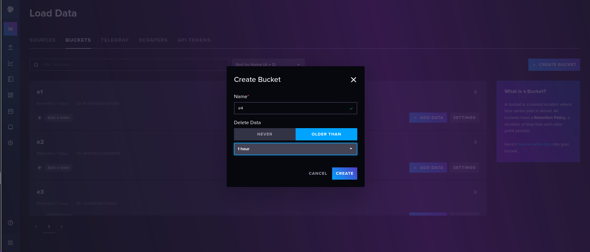

# Usage

## Setting up database

Before following the steps below, ensure you have already executed [installation](../README.md) tutorial.

The tool is based on [InfluxDB](https://www.influxdata.com/). You've already created a docker container instance for it. Therefore, you should access the client through your browser. Then, type the following link in the URL bar:

```
http://localhost:8086
```

After that you'll encounter the following page:


Get started and create new credentials to your database. You can choose *username*, *password* and *Initial Bucket Name*, but the *Initial Organization Name* must be **MM-Int** like in the image below:




Copy the *TOKEN* in the next page and paste into **.env.examle**. You also have to rename this file to **.env**. 



Click on **Configure Later** and lets create new buckets



Here you should create 4 buckets. You can choose the names, but I suggest choose simple names, cause each one will store data from each edge switch in the topology. In this case, I have named as **e1, e2, e3 and e4**.




## Running Topology

In the root directory execute the following command:
```bash
sudo python3 main.py -s 3
```
or 
```bash
sudo python3 main.py -s 1
```

The flag *-s* selects the solution. If you don't know about the 
solutions, you can read the article with details.<br><br>

## Managing tool

If you've done everything correctly so far, the Mininet CLI should be open.

*MININET CLI IMAGE*

The following topology is running:

*TOPOLOGY IMAGE*

You can test it sending a PING packet from h1 to h2:

```
h1 ping h2 -c 1
```

The expect result is:

*IMAGE OF RESULT*

#

Now you can simulate traffic and INT probes

  **TRAFFIC** <br>
  Supose that you wanna send traffic from h1 to h2:
   - Open h1 and h2 terminals
  ```
  xterm h1 h2
  ```
   - Into h2 terminal type the following command to create a server to receive packets:
  ```
  sudo iperf -s -u
  ``` 
   - Into h1 terminal type:
  ```
  sudo iperf -c 10.0.1.2 -i 1 -t 300 -u -b 10M
  ```
  In the command above, you've create a packet sender with 10Mbps band.

In this way, you have traffic circulating in your network, but it is not visible. If you wanna see the packets getting to
the destiny, open another terminal in *h2* and type:  
```
xterm h2
```
 - and after:
```
sudo tcpdump -i eth1
```
#

  **INT PROBES** <br>
  Now you can send and collect INT probes on the topology and visualize the collected data:
  
   - Open a terminal in e2:
   ```
   xterm e2
   ```
   - Navigate to the packet-tools path:
  ```
  cd util/packet-tools/
  ```
   - Here you'll activate the probes receiver:
  ```
  sudo python3 receive-probes.py -s 3 -i e2-eth1 -db e2
  ```
  *Note that **-s** is the flag for solution you've chose (1 or 3), **-i** is the interface connected to the core switch*
  *and **-db** is the name of bucket created in your database (in my case, e1, e2, e3, and e4).* <br><br>
  *If you wanna create log files, use the **-f** flag accompanied by the name of file you want.*
  
   - Open a terminal in h1:
  ```
  xterm h1
  ``` 
   - Navigate to the path of packet-tools:
  ```
  cd util/packet-tools/
  ```
   - Now you're ready to send probes:
  ```
  sudo python3 send-probes.py 10.0.1.2
  ```
  In the command above, you'll send probes to h2, but the behavior of probes will change depending 
  on the solution you have chose (1 or 3). Read the **article** for more information.<br><br>

## Exploring data
Getting back to the InfluxDB, open your browser again.
 - Steps to upload the template and visualize data
